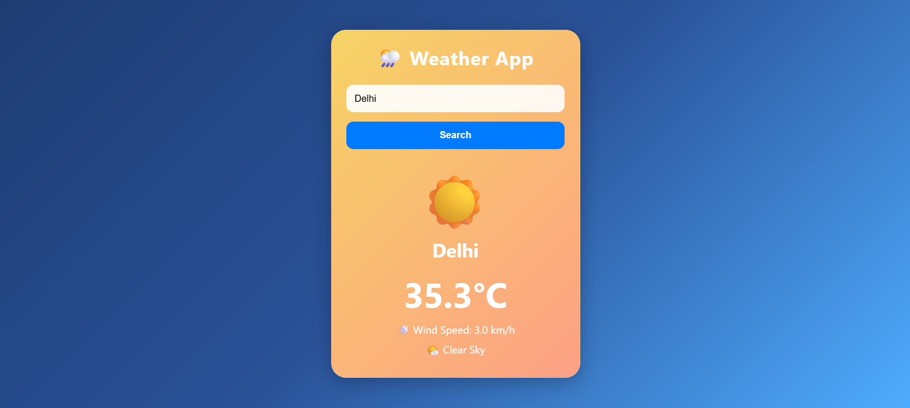

# 🌦️ Weather App

A modern full-stack Weather Application that provides real-time weather information for cities around the world.

## 🚀 Live Demo

🌐 Frontend: https://weather-app-wine-eight-79.vercel.app/

⚙️ Backend API: https://weather-app-c5gk.onrender.com

---

## 📸 Project Screenshot



---

## ✨ Features

- 🔍 Search weather by city name
- 🌡️ Real-time temperature data
- 💨 Wind speed information
- 🌤️ Weather condition detection
- 🎨 Dynamic weather-based themes
  - ☀️ Sunny
  - ☁️ Cloudy
  - 🌧️ Rainy
  - ⛈️ Thunderstorm
  - ❄️ Snowy
  - 🌫️ Foggy
- ⌨️ Search using Enter key
- ⏳ Loading spinner
- ❌ Error handling
- 📱 Responsive UI
- 🌐 Live deployment

---

## 🛠️ Tech Stack

### Frontend

- HTML5
- CSS3
- JavaScript (ES6)
- Fetch API

### Backend

- FastAPI
- Python
- Requests

### APIs

- Open-Meteo API
- Open-Meteo Geocoding API

### Deployment

- Vercel (Frontend)
- Render (Backend)
- GitHub

---

## 📂 Project Structure

```text
Weather App
│
├── backend
│   ├── main.py
│   └── api
│       └── weather.py
│
├── frontend
│   ├── index.html
│   ├── style.css
│   └── script.js
│
├── requirements.txt
├── README.md
└── .gitignore
```

---

## ⚙️ Installation

### Clone Repository

```bash
git clone https://github.com/adri-chak/Weather-App.git
cd Weather-App
```

### Create Virtual Environment

```bash
python -m venv venv
```

### Activate Environment

Windows:

```bash
venv\Scripts\activate
```

### Install Dependencies

```bash
pip install -r requirements.txt
```

### Run Backend

```bash
cd backend
uvicorn main:app --reload
```

Backend runs at:

```text
http://127.0.0.1:8000
```

### Run Frontend

Open:

```text
frontend/index.html
```

or use VS Code Live Server.

---

## 📡 API Endpoints

### Home

```http
GET /
```

Response:

```json
{
  "message": "Hello Weather App"
}
```

---

### Weather

```http
GET /weather?city=Kolkata
```

Response:

```json
{
  "city": "Kolkata",
  "temperature": "27.4°C",
  "wind_speed": "6.8 km/h",
  "weather_code": 95
}
```

---

## 🎯 Learning Outcomes

This project helped me learn:

- FastAPI fundamentals
- REST API development
- API integration
- Frontend–Backend communication
- CORS handling
- JavaScript Fetch API
- Async programming
- Deployment with Render
- Deployment with Vercel
- Git & GitHub workflow

---

## 🔮 Future Improvements

- Humidity information
- 7-day forecast
- Air Quality Index (AQI)
- Weather charts
- Geolocation support
- Dark/Light mode
- Search history
- Weather icons API

---

## 👨‍💻 Author

**Adrija Chakraborty**

GitHub: https://github.com/adri-chak

---

⭐ If you like this project, consider giving it a star!